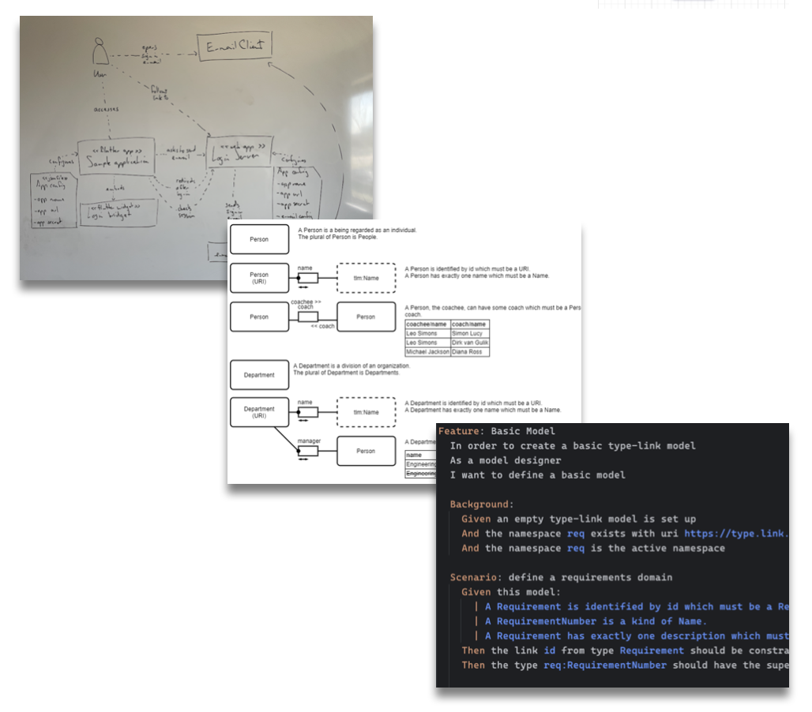
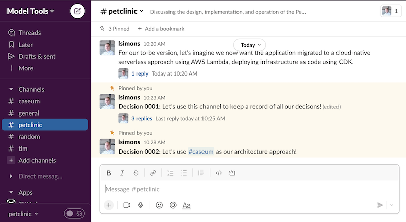

<!--suppress HtmlDeprecatedAttribute, CheckImageSize -->


# Caseum

[Caseum](http://lsimons.github.io/caseum/) is a simple approach to software architecture that combines multiple views to boost understanding and empathy across roles.

## Video introduction

<!-- markdownlint-disable MD034 -- bare URL renders as a video embed on GitHub -->

https://github.com/lsimons/caseum/assets/47133/890185f5-cc6f-42d5-887b-34939f8070c0

<!-- markdownlint-enable MD034 -->

([watch on YouTube](https://youtu.be/0s1qPY-W1ew), [slides](docs/public/presentations/introduction.pdf))

## Multiple views

Caseum combines these views:

- **C**omponents using C4
- **A**ctors using roles
- **S**tories using Gherkin
- **E**vents using event storming
- **U**I using wireframes
- **M**odels using facts



Together these views fully describe a software system.

Not all projects need all views.

## Lightweight approach

Caseum is for doing just enough architecture. It has three stages:

1. whiteboarding & dialogue
2. digital diagrams & decision records
3. models as code & executable specifications

Not all projects need all stages.

See the [guide on stages of architecture](https://lsimons.github.io/caseum/guides/stages/). See the [guide on as-is and to-be designs](https://lsimons.github.io/caseum/guides/as-is-to-be/) for working on existing projects.

## Recording decisions



Architecture records the important design decisions for a system. The records are for communicating with current and future people working on and with the software.

See the [guide on recording decisions](https://lsimons.github.io/caseum/guides/records/).

## Tools


The primary tools used by Caseum are:

- Whiteboards, markers, and sticky notes
- Draw.io for digital diagrams
- Markdown text files for decision records
- Model specification in structured text formats (Structurizr C4, Gherkin, LinkML and AsyncAPI JSON)

See the guides on [whiteboarding architecture](https://lsimons.github.io/caseum/guides/whiteboarding/) and on [using draw.io for architecture](https://lsimons.github.io/caseum/guides/drawio/).

Different tools are available per view per stage:

|                | **Whiteboarding &<br/> Dialogue**                                              | **Diagrams &<br/> Decision Records**                                                     | **Models &<br/> Executable Specifications**                        |
| -------------- | ------------------------------------------------------------------------------ | ---------------------------------------------------------------------------------------- | ------------------------------------------------------------------ |
| **Components** | [Boxes & lines](https://lsimons.github.io/caseum/components/c4-whiteboarding/) | [C4 Draw.io Library](https://lsimons.github.io/caseum/components/c4-template/)           | [C4 as Code](https://lsimons.github.io/caseum/components/c4-code/) |
| **Actors**     | [Roles & needs](https://lsimons.github.io/caseum/actors/actor-whiteboarding/)  | [Role Markdown Template](https://lsimons.github.io/caseum/actors/role-template/)         | -                                                                  |
| **Stories**    | [Goals & epics](https://lsimons.github.io/caseum/stories/story-whiteboarding/) | [User Story Markdown Template](https://lsimons.github.io/caseum/stories/story-template/) | [Gherkin](https://lsimons.github.io/caseum/stories/gherkin-code/)  |
| **Events**     | [Event Storming](https://lsimons.github.io/caseum/events/event-storming/)      | [ES Draw.io Library](https://lsimons.github.io/caseum/events/event-template/)            | [AsyncAPI](https://lsimons.github.io/caseum/events/asyncapi-code/) |
| **UI**         | [Boxes & lines](https://lsimons.github.io/caseum/ui/ui-whiteboarding/)         | [Wireframes Draw.io Library](https://lsimons.github.io/caseum/ui/ui-template/)           | -                                                                  |
| **Models**     | [Circles & lines](https://lsimons.github.io/caseum/models/fact-whiteboarding/) | [Model diagrams](https://lsimons.github.io/caseum/models/model-diagrams/)                | [LinkML](https://lsimons.github.io/caseum/models/linkml-code/)     |

## License

<a rel="license" href="http://creativecommons.org/licenses/by/4.0/"></a><span xmlns:dct="http://purl.org/dc/terms/" property="dct:title">Caseum</span> by <a xmlns:cc="http://creativecommons.org/ns#" href="https://caseum.org" property="cc:attributionName" rel="cc:attributionURL">Leo Simons</a> is licensed under a <a rel="license" href="http://creativecommons.org/licenses/by/4.0/">Creative Commons Attribution 4.0 International License</a>.

See [LICENSE.txt](LICENSE.txt) for a plain text copy of the Creative Commons Attribution 4.0 International License.

## Contributing

See [CONTRIBUTING.md](CONTRIBUTING.md) for details on how to contribute to Caseum.

## Code of conduct

See [Code of Conduct](CODE_OF_CONDUCT.md) for details on how to participate in the Caseum community.

## Building the site

The documentation site is built with [Astro Starlight](https://starlight.astro.build/)
and published to GitHub Pages at <https://lsimons.github.io/caseum/>. Tools are
pinned in `mise.toml`; run `mise install` once, then:

```bash
just docs-install   # install site dependencies (bun)
just docs-dev       # dev server at http://localhost:4321/caseum/
just docs-build     # build the static site into docs/dist
```

Content lives in `docs/src/content/docs/`; assets and downloads in
`docs/public/`. A push to `main` builds and deploys via GitHub Actions.

The favicon (`docs/public/favicon.svg` + `apple-touch-icon.png`) is a honeycomb
generated from the logo's color palette; regenerate it with
`docs/scripts/gen-favicon.mjs` if the palette changes.
