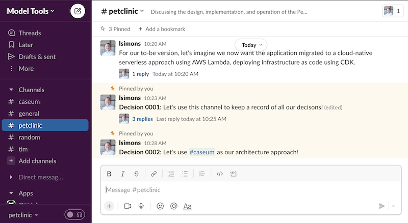

# Caseum

Caseum is a lightweight approach to software architecture using multiple views.

## Multiple views

Caseum combines these views:
* **C**omponents using C4
* **A**ctors using personas
* **S**tories using Gherkin
* **E**vents using event storming
* **U**I using wireframes
* **M**odels using TLM

Together these views fully describe a software system.

Not all projects need all views.

## Lightweight approach

Caseum is for doing just enough architecture. It has three stages:

1. brainstorming & whiteboarding
2. digital diagrams & decision records
3. models as code & executable specifications

Not all projects need all stages.

See the [guide on stages of architecture](docs/guides/stages.md).

## Recording decisions

Architecture records the important design decisions for a system. The records are for communicating with current and future people working on and with the software.

See the [guide on recording decisions](docs/guides/records.md).

## Tools

The primary tools used by Caseum are:

* Whiteboards, markers, and sticky notes
* Draw.io for digital diagrams
* Markdown text files for decision records
* Model specification in structured text formats (Structurizr C4, Gherkin, TLMD and CloudEvents JSON)

See the guides on [whiteboarding architecture](docs/guides/whiteboarding.md) and on [using draw.io for architecture](docs/guides/drawio.md).

Different tools are available per view per stage:

|                     | **Brainstorming & Whiteboarding**               | **Diagrams & Decision Records**                           | **Models & Executable Specifications**    |
|---------------------|-------------------------------------------------|-----------------------------------------------------------|-------------------------------------------|
| **Components**      | [Boxes & lines](docs/components/c4-whiteboarding.md) | [C4 Draw.io Library](docs/components/c4-template.md)           | [C4 as Code](docs/components/c4-code.md)       |
| **Actors**          | [Roles & needs](docs/actors/actor-whiteboarding.md)  | [Persona Markdown Template](docs/actors/persona-template.md)   | -                                         |
| **Stories**         | [Goals & epics](docs/stories/story-whiteboarding.md)         | [User Story Markdown Template](docs/stories/story-template.md) | [Gherkin](docs/stories/gherkin-code.md)        |
| **Events**          | [Event Storming](docs/events/event-storming.md)      | [ES Draw.io Library](docs/events/event-template.md)            | [CloudEvents](docs/events/cloudevents-code.md) |
| **UI**              | [Boxes & lines](docs/ui/ui-whiteboarding.md)         | [Wireframes Draw.io Library](docs/ui/ui-template.md)           | -                                         |
| **Models**          | [Circles & lines](docs/models/fact-whiteboarding.md)   | [TLM Draw.io Library](docs/models/tlm-template.md)             | [TLMD](docs/models/tlm-code.md)                |

## License

Caseum by <a xmlns:cc="http://creativecommons.org/ns#" href="https://github.com/lsimons/caseum" property="cc:attributionName" rel="cc:attributionURL">Leo Simons</a> is licensed under a <a rel="license" href="http://creativecommons.org/licenses/by/4.0/">Creative Commons Attribution 4.0 International License</a>.

See [LICENSE.txt](LICENSE.txt) for a plain text copy of the Creative Commons Attribution 4.0 International License.
