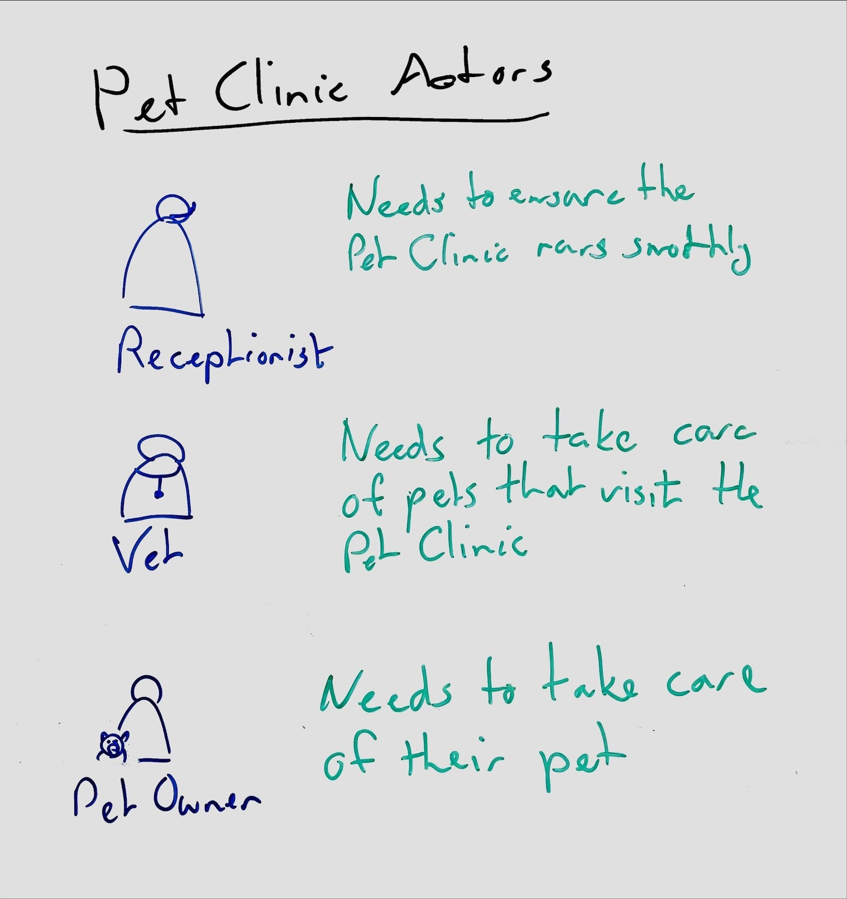

<!--suppress HtmlDeprecatedAttribute, CheckImageSize -->
# Whiteboarding actors

**Always consider a system's customers, users, and stakeholders. Also consider external systems that connect to the system. Together, these are the _actors_.**

When designing software only used by other systems, consider the customers, users, and stakeholders of those systems.

When designing software it helps to always keep these actors in mind, so in most views it helps to always draw them and to draw them first. Rather than design the system for a generic user, be clear about which users use the system.

If you have followed an approach like design thinking you may already have a clear description of the human actors, which you can just summarize for use in Caseum.

In other cases, it may be quite hard to become clear about which actors the system is for. This can be the case, for example, if stakeholders disagree! If so, that hard work *must* happen before other designs are made.

## Basic actors

For human actors, capture at least:

* **role name**: the descriptive label of the role of this actor in the wider context in which the software system is used.
* **need**: what actors in this role need to accomplish that they use the software system for.

For non-human actors, capture at least:

* **category name**: a descriptive label that applies to all similar software systems that use the system.
* **purpose**: why the external system is connecting to this system.

You don't have to capture all the non-human actors, only the important ones that you specifically design for. For example, when designing a website, you often don't need to draw the web browsers users will use to access the site.

Draw each actor with an icon. See [this FontAwesome collection of users](https://fontawesome.com/icons/categories/users-people?f=classic&s=regular) for some icons you might try to draw, but don't get too fancy: it's important to keep them simple so you and others working on the design can draw them easily and similarly many times. A simple way to draw an actor is as a circle for their head with a rectangle just underneath it for their upper torso. Then, write their role underneath to make clear which actor it is.

## Non-actors

It can help to be clear about people that are close to the software system who do not interact with the software system themselves. You might write them down and then mark them as not actors.

For example, a software system in a hospital may be very patient-centric but not ever used by the patients themselves, instead only being accessible by the medical staff.

## Bad actors

It can sometimes help to be clear about people who should not interact with the software system but will try to do so anyway. This is especially important if the software is a security system or if security is a major feature of the system.

For systems where the security is "standard" or handled "in some standard way", do not include these actors in the main view. Instead, you may later draw some specific security views that have these bad actors included.

## User-centric design vs actors

In user experience design, [empathy maps](https://en.wikipedia.org/wiki/Empathy_Map) describe users' pains and gains, what they think and say and do and feel.

Similarly, user experience designers may define fictional characters called [personas](https://en.wikipedia.org/wiki/Persona_(user_experience)) that help the designer imagine what to create.

These are quite a valuable research and design tool. But such empathy maps and personas are not part of Caseum and not quite the same as an actor description.

From these user-centric designs, distill a more generic (cold, clear, clean, factual) role description for use in the creation of the software architecture. You might link these together with a few statements such as "User {name} has the role {role} while working with {software system}".

## Using color

Draw the actors in blue and their needs in green.

Draw any non-actors in black.

Draw any bad actors in red.
