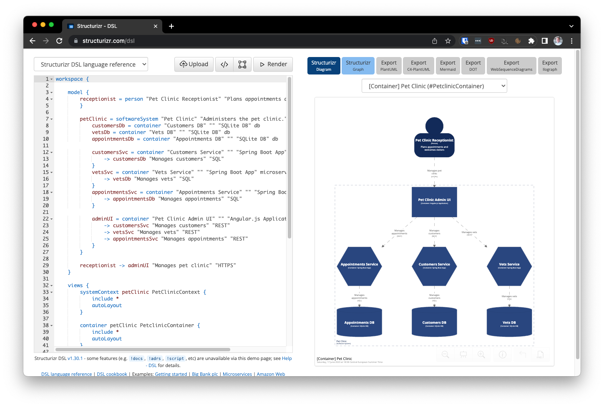

# Modeling components in code using C4 and Structurizr

**Use [Structurizr](https://structurizr.org/) to model the components of your system in code.**



C4 is perhaps the most popular way to describe the component architecture of software and Caseum adopts it.

When using C4 models-as-code, Caseum uses Structurizr.

Structurizr supports using custom styles to match the Caseum color scheme:
```
workspace {
    model {
        ...
    }

    views {
        ...

        styles {
            element "Software System" {
                background #122A59
                color #ffffff
            }
            element "Container" {
                background #29467F
                color #ffffff
            }
            ...
        }
    }   
}
```

Here's an example C4 model you can paste into the [Structurizr DSL](https://structurizr.com/dsl) to get started:

```c4
workspace {
    model {
        receptionist = person "Pet Clinic Receptionist" "Plans appointments and welcomes visitors" {
        }
        
        petClinic = softwareSystem "Pet Clinic" "Administers the pet clinic." {
            customersDb = container "Customers DB" "" "SQLite DB" db
            vetsDb = container "Vets DB" "" "SQLite DB" db
            appointmentsDb = container "Appointments DB" "" "SQLite DB" db

            customersSvc = container "Customers Service" "" "Spring Boot App" microservice {
                -> customersDb "Manages customers" "SQL"
            }
            vetsSvc = container "Vets Service" "" "Spring Boot App" microservice {
                -> vetsDb "Manages vets" "SQL"
            }
            appointmentsSvc = container "Appointments Service" "" "Spring Boot App" microservice {
                -> appointmentsDb "Manages appointments" "SQL"
            }

            adminUI = container "Pet Clinic Admin UI" "" "Angular.js Application" webapp {
                -> customersSvc "Manages customers" "REST"
                -> vetsSvc "Manages vets" "REST"
                -> appointmentsSvc "Manages appointments" "REST"
            }
        }
        
        receptionist -> adminUI "Manages pet clinic" "HTTPS"
    }

    views {
        systemContext petClinic PetClinicContext {
            include *
            autoLayout
        }
        
        container petClinic PetclinicContainer {
            include *
            autoLayout
        }

        styles {
            element "Software System" {
                background #122A59
                color #ffffff
            }
            element "Container" {
                background #29467F
                color #ffffff
            }
            element "microservice" {
                shape Hexagon
            }
            element "db" {
                shape Cylinder
            }
            element "Person" {
                shape person
                background #122A59
                color #ffffff
            }
        }
    }   
}
```

## Keep it accessible

Note that while the C4 website recommends using models as code, Caseum recommends [using a whiteboard](c4-whiteboarding.md) initially and for as long as possible, and to also consider [digital diagrams](c4-template.md) before making models using code.
