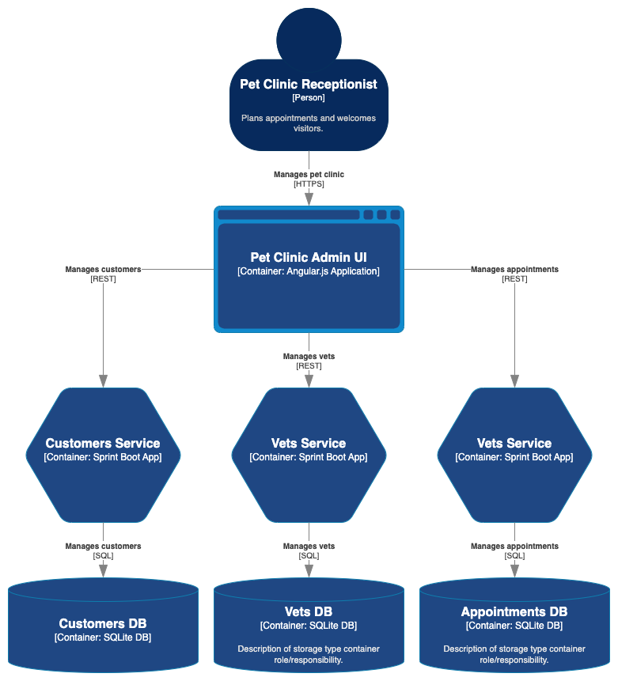

# Describing components with C4 diagrams

**Use [C4 diagrams](https://c4model.com/) to describe the components of your system.**

C4 is perhaps the most popular way to describe the component architecture of software and Caseum adopts it.

For digital C4 diagrams, Caseum uses draw.io.

Draw.io supports C4 diagrams natively with a Shape library that you can use. You can also use these drawing tools to match the Caseum color scheme:

* [Caseum-C4.xml](Caseum-C4.xml): a [draw.io](https://www.diagrams.net/) modified C4 shape library with C4 elements using the Caseum colors. [User guide](https://desk.draw.io/support/solutions/articles/16000067790).
* [C4.drawio](C4.drawio): a draw.io stencil containing the elements in the custom shape library.

## Keep it accessible

Note that while the C4 website recommends using [models as code](c4-code.md), Caseum recommends [using a whiteboard](c4-whiteboarding.md) initially and for as long as possible, and to also consider digital diagrams before making models using code.
