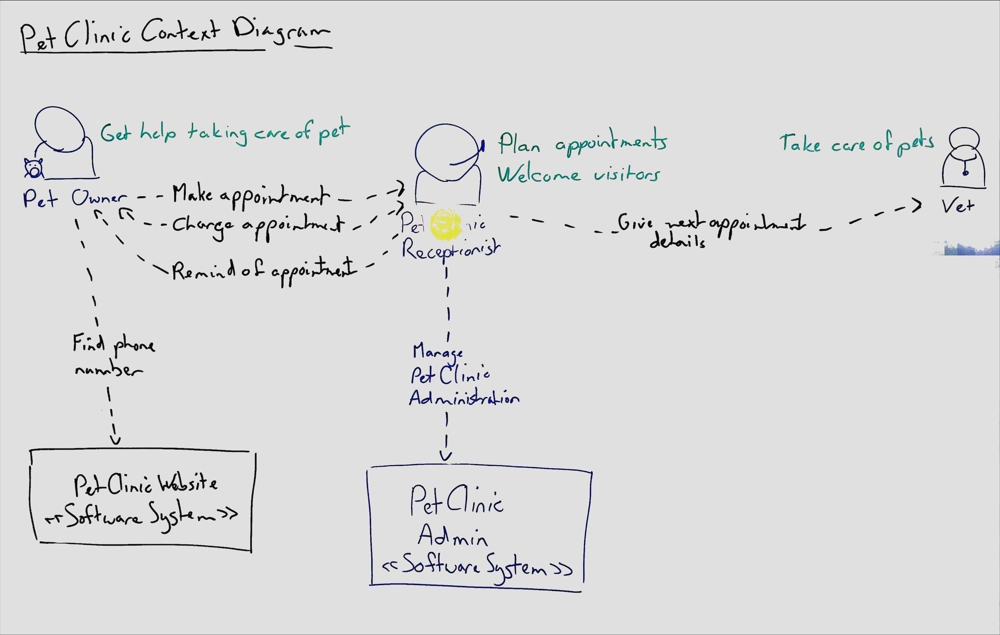

# Whiteboarding components with C4 diagrams

**Use [C4-style diagrams](https://c4model.com/) to draw the components of your system on a whiteboard.**

**It isn't important to follow the C4 model exactly. Focus on the story you want to tell with your diagrams.**

## Context Diagram

The context diagram is the highest-level diagram in C4. It shows the software system in context of its environment.

Do not skip the context diagram when drawing architecture on the whiteboard. The context diagram grounds the architecture story in the business context. It connects the [actors](../actors/actor-whiteboarding.md) and [stories](../stories/story-whiteboarding.md) to the component architeture.

If you don't know where to start, follow this process:
* First, draw the actors, at the top of the whiteboard.
* Next, draw the software systems in the middle of the whiteboard.
* Then, draw the connections between the actors and the software systems.
* Avoid drawing system boundaries on the whiteboard, they clutter the board.

## Container Diagram

When designing small systems you can skip the container diagram initially.

The container diagram connects the C4 context to the C4 components. It shows the high-level parts of the software system and how they connect.

If you don't know where to start, follow this process:
* First, draw the actors, at the top of the whiteboard.
* Next, draw any databases or other low-level containers at the bottom of the whiteboard.
* Then, draw the sofware systems in the middle of the whiteboard.
* Finally, draw the connections between the actors and the software systems and between the software systems and the databases.

## Component Diagram

The component diagram is the lowest-level C4 diagram to draw on a whiteboard. It shows all the software components that make up a (sub)system and how they connect together. The component diagram is often most useful to developers while deciding how to implement a system, while it can be too detailed for other stakeholders.

When drawing the component diagram on the whiteboard, focus on the components that are most important to the story you are telling. You don't need to add the full details of all components in the system.

If you skipped making the container diagram, once there are more components to a system than can fit on one whiteboard, go back and summarize the component diagram as a container diagram.

## Keep it accessible

Note that while the C4 website recommends using [models as code](c4-code.md), Caseum recommends using a whiteboard initially and for as long as possible, and to also consider [digital diagrams](c4-template.md) before making models using code.
