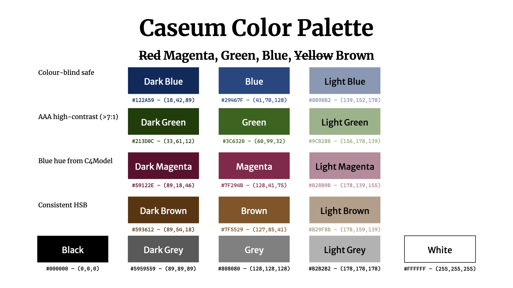

Caseum uses the following color scheme:

### Color usage
* Black: text (on white or light background), lines
* White: text (against main colors and dark colors)
* Main:
  * Blue: primary
  * Green: secondary
  * Brown: tertiary
  * Magenta: highlight/alert
  * Grey: faded/background/disabled/external
* Dark colors: special/focus
* Light colors: accent/background/selection/grouping

### Color numbers
* main
  * Blue: #29467F — (41,70,128)
  * Green: #3C6320 — (60.99,32)
  * Magenta: #7F294B — (128,41,75)
  * Brown: #7F5529 — (127,85,41)
* dark
  * Dark Blue: #122A59 — (18,42,89)
  * Dark Green: #213D0C — (33,61,12)
  * Dark Magenta: #59122E — (89,18,46)
  * Dark Brown: #593612 — (89,54,18)
* light
  * Light Blue: #8B98B2 — (139,152,178)
  * Light Green: #A1B28B — (161,178,139)
  * Light Magenta: #B28B9B — (178,139,155)
  * Light Brown: #B29F8B — (178,159,139)
* grayscale
  * Black: #000000 — (0,0,0)
  * Dark Grey: #595959 — (89,89,89)
  * Grey: #808080 — (128,128,128)
  * Light Grey: #B2B2B2 — (178,178,178)
  * White: #FFFFFF — (255,255,255)

### Background

These colors are all high-contrast vs black or white (7:1 or more), ranking them as AAA according to WCAG accessibility guidelines.

The colors are selected to be somewhat distinguishable by most people with most kinds of color blindness.

The colors are selected to align closely to black+RGB which are common whiteboard marker colors, which helps when transcribing whiteboard drawings.

Red is avoided since it can mean different things across cultures, and is most commonly difficult to distinguish for the color-blind.

The colors are selected to look "ok" on screen and in print, even when printed using grayscale. The colors are selected to be bold and distinguishable.

The main blue color is chosen to have the same hue as the blue used in C4 diagrams, though with a higher contrast. This makes combined Caseum/C4 diagrams look "ok".
