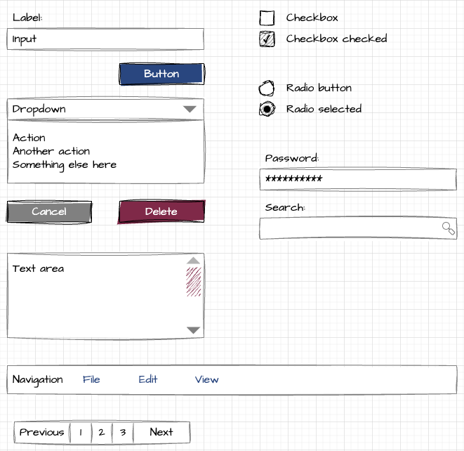

Caseum designs can include some UI design.

Caseum UI designs focus on functionality. Caseum does not include high quality visuals.

Designs are made with wireframes using a mockup visual style.

Drawing tools:

* [Caseum-Wireframe.xml](Caseum-Wireframe.xml): a [draw.io](https://www.diagrams.net/) custom shape library with simple mockup elements using the Caseum colors. [User guide](https://desk.draw.io/support/solutions/articles/16000067790).
* [wireframe.drawio](wireframe.drawio): a draw.io stencil containing the elements in the custom shape library.

Visually, Caseum UI designs look like this:

Caseum UI designs may be implemented directly in software by developers with access to a design system. Or, the UI may be further designed in a high quality visual design tool like [Figma](https://www.figma.com/).
