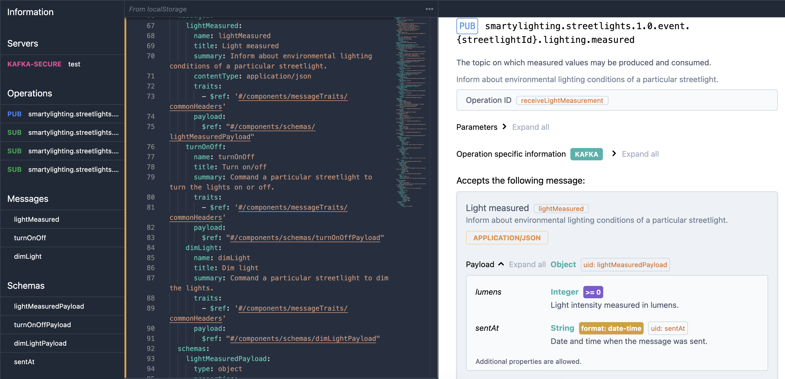

# Modeling events in code using AsyncAPI

**Use a specification based on JSON Schema to model the events of your system in code.**

**For an event-heavy system use the [AsyncAPI specification](https://www.asyncapi.com/). For a system with mostly RESTful APIs, use the [OpenAPI specification](https://www.openapis.org/) instead.**

## Which JSON Schema specification is best?

[JSON Schema](https://json-schema.org/) is a modern schema language that is used to define the structure of JSON documents. JSON Schema is embedded in the widely adopted OpenAPI specification to define the structure of RESTful APIs. The somewhat newer AsyncAPI specification is a lot like OpenAPI, but with specific support for event-driven systems.

Which standard should you use? In mid-2023, if your architecture is mostly based on services and their interactions, go with OpenAPI, since it has more tooling support and is more widely used. If instead you have many asynchronous interactions in your system, or many of the interactions are multi-producer or multi-subscriber, then AsyncAPI is a better choice.

## XML Schema

The most powerful schema language in common use today for modeling entity representations in APIs is XML Schema. XML Schema is used by SOAP, the Simple Object Access Protocol, which really is not simple. SOAP also has other problems. SOAP was popular 15 years ago but is not popular today. Perhaps in part because of this, XML Schema and XML are also less popular.

If you must interface with XML-based systems you might adopt XML Schema _in addition_ to JSON Schema. As of late 2022 the best way to convert between XML Schema and JSON Schema is the commercial product [Altova XMLSpy](https://www.altova.com/xmlspy-xml-editor), which may be worth investing if you have to maintain schemas with 50 elements or more.

## Model mapping is a chore

If you use domain models and fact-based modeling that effort can form the basis of the entity definitions in your JSON Schema. In this case your OpenAPI or AsyncAPI specifications can import those entity definitions. This approach works well for medium-size systems.

You probably won't have such models-as-code for small systems since those don't need models-as-code architecture. As mentioned in the [Guide on stages](../guides/stages.md), actively try to avoid over-engineering small systems.

On the other end, for large systems that are worked on by multiple teams in parallel you need loose coupling between subsystems so the teams can work somewhat independently. In this case you need to decouple the domain model for a subsystem from the event/API representations of the entities that are communicated with that subsystem. You then end up with significant duplication in architecture and implementation, and ongoing effort to maintain a mapping between internal models and external event specifications.

There is no perfect way to avoid this mapping effort. There are many approaches to creating and maintaining model mappings. Caseum makes no recommendations on this topic, beyond the general advice to plan for it deliberately and to then record the design decisions you take on it.

## Alternatives to JSON Schema

These are reasonable alternatives worth considering:

* [OData](https://www.odata.org/) is more prescriptive. If it fits your needs then you can use the OData tooling ecosystem and get functionality for free. OData is used by Microsoft Azure, Dynamics, and Office 365. While it is an open standard with many implementations, the best OData tool support is in the Microsoft ecosystem, specifically in .Net and Visual Studio.

* [GraphQL](https://graphql.org/) is a powerful approach to create flexible APIs that are *just right* for the *consumer* of that API. This is often worth the investment when building user interfaces, especially mobile applications. For very large systems you may have GraphQL APIs between frontend and backend systems, and OpenAPI or AsyncAPI schemas for use among backend systems.

* [Apache Avro](https://avro.apache.org/), [Apache Thrift](https://thrift.apache.org/), [GRPC](https://grpc.io/) with [Protocol Buffers](https://protobuf.dev/), [Cap'n Proto](https://capnproto.org/), [ZeroMQ](https://zeromq.org/) with [ABNF](https://en.wikipedia.org/wiki/Augmented_Backus%E2%80%93Naur_form), or one of many other such more specific technology choices. If one of these is the right choice for your application, and you define a schema for it, avoid duplicating those schema definitions in JSON Schema.

## Alternatives to using an open standard

You can work without any standard or schema for your event definitions. This may couple your architecture to a specific (commercial) technology. That is not always bad! For example it may save you significant time and effort and result in a simpler and smaller solution. Many architects and developers intuitively don't like such choices, since they are afraid of the loss of flexibility. Making this tradeoff is an important architecture choice. So, take some time to make this decision and [record](../guides/records.md) it.

Choosing between open standards and proprietary technology is not all-or-nothing. For example, you can map schemas in architecture but not in code.

Specific commercial technology may come with its own reasonable schema language. For example, TIBCO BusinessWorks uses a proprietary schema language for its XML-based message formats. You can use the TIBCO schema language for your event definitions, and then use tooling to convert between TIBCO schema and JSON Schema. You still tie most of your system to the TIBCO schema and protocol. You do have a route toward interoperability by introducing adapters to JSON Schema if that becomes important.

## Industry standards should influence architecture choices

The choice of schema language can depend on the business domain you are working in. There are various industries with extensive standard schema definitions and these are often worth using.

For example, the [HL7](https://www.hl7.org/) v3 and CDA standards for healthcare data exchange are based on XML Schema. These standards and probably more widely deployed in 2023 than the newer [HL7 FHIR](https://hl7.org/fhir) which supports JSON Schema.

In other domains, JSON and XML are not appropriate technology and then it makes no sense to use their schema languages. For example, if you work on an automotive system using the [CAN bus](https://en.wikipedia.org/wiki/CAN_bus), messages may defined at a lower protocol layer. In such a case you stick to using a text description of the messages instead of a schema language.
