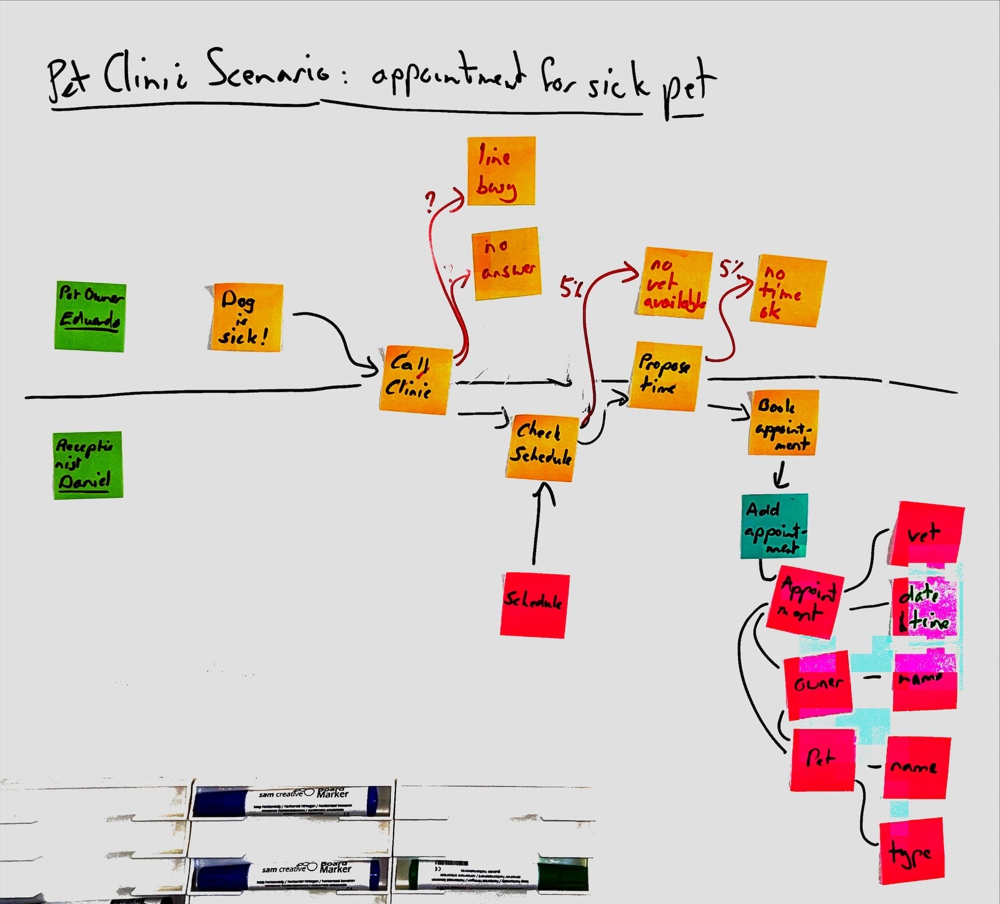

<!--suppress CheckImageSize, HtmlDeprecatedAttribute -->
# Whiteboarding Events

**Use [event storming](https://www.eventstorming.com/) to describe the events of your business domain.**

Event storming is more useful the more complex the domain that you are designing for. It is especially useful for designing systems with complex business logic or with diverse stakeholders.

The [event storming website](https://www.eventstorming.com/) has a lot of good advice on event storming that is not repeated here. All of the event storming advice is quite compatible with the whiteboarding stages of Caseum.

## How much to focus on events depends on your problem

In his tutorials and his book, the creator of event storming, Alberto Brandolini, describes design workshops that start out with event storming as the very first step. This step is taken together with business stakeholders. After capturing the initial events he adds other views and details later, working with the technical team. This approach seems especially appropriate for capturing the description of existing systems.

Contrast this with the Caseum [stages guide](../guides/stages.md) which suggests defining some actors, some stories, and some UI first, before diving into domain events. This approach could be more appropriate for designing new systems from scratch. Try both approaches and see which works best for you!

## Digital event design using templates

The main downside of a digital approach to event views using event storming is that the focus on drawing "the whole picture" or "the entire process" leads to very large diagrams that don't fit well on monitors.

So when switching to digital designs, Caseum instead has an [event template](event-template.md) for capturing events.
