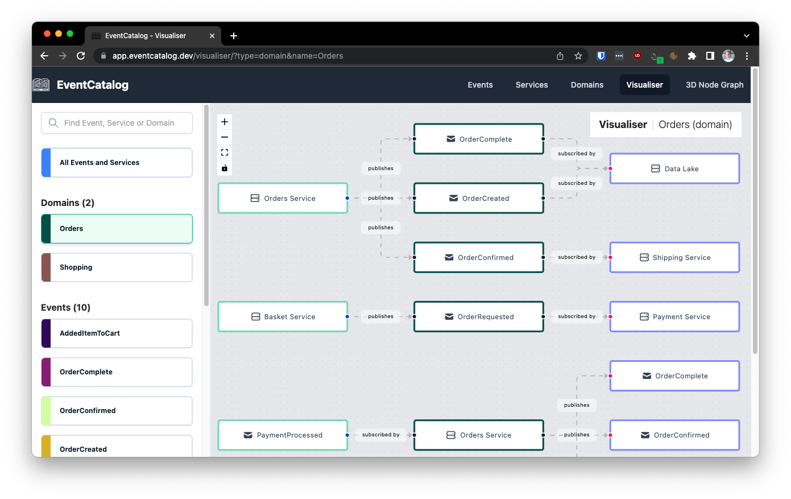

<!--suppress HtmlDeprecatedAttribute, CheckImageSize -->
# Describing events with an event description

**Keep a short, clear list of event descriptions.**

Caseum provides a simple template for event descriptions in markdown.

## Event description markdown template

Here's a markdown template for capturing events:

```markdown
### Event: {event name}
{Short event summary.}

- producers:
    - {producer #1}
    - {producer #2}
- consumers:
    - {consumer #1}
    - {consumer #2}

{Detailed event description.}
```

The summary should be a short sentence that describes the event.

The producers and components are the actors and components producing and consuming events.

The optional detailed description gives more information about the event.

## Event examples

Here are some example event descriptions:

### Event: PetOwnerArrived
Pet owner has arrived at the clinic with their pet.

- producers:
    - pet owner
- consumers:
    - receptionist

### Event: PetOwnerCheckedIn
Pet owner has checked in at the reception desk.

- producers:
    - receptionist
- consumers:
    - vet

### Event: AppointmentScheduleChanged
Receptionist has adjusted the appointment schedule.

- producers:
    - receptionist
- consumers:
    - vet
    - pet owner

## Alternatives

While Markdown templates are fine for [actors](../actors/role-template.md) or [stories](../stories/story-template.md), they are not ideal for events, where the relationship between events and their producers and consumers are particularly important to see.

So here are some alternatives to consider:

### Visual organization of events using EventCatalog

[EventCatalog](https://www.eventcatalog.dev/) is a nice tool for managing event descriptions.

EventCatalog provides a simple markdown template to start with and also allows embedding formal schemas. It provides an open source downloadable tool to visualize those events in different ways.



Unfortunately the EventCatalog Markdown format for events does not render well as plain markdown files: you really need to install and use the tool yourself to use the Markdown format. This is why Caseum provides its own simpler template format.

But if you can set up and use EventCatalog and make it accessible to everyone on your team, it is a great tool to use instead.

### More formal event storming via event modeling

Adam Dymitruk has described an approach to design called [event modeling](https://eventmodeling.org/) ([blog post 1](https://eventmodeling.org/posts/what-is-event-modeling/), [blog post 2](https://eventmodeling.org/posts/event-modeling-traditional-systems/)), which is conceptually similar to [event storming](event-storming.md), and has a somewhat more structured approach works well digitally. As a method it is very similar to Caseum during stage 2, creating multiple views. It is similar to event storming in that it focuses on the event view.
