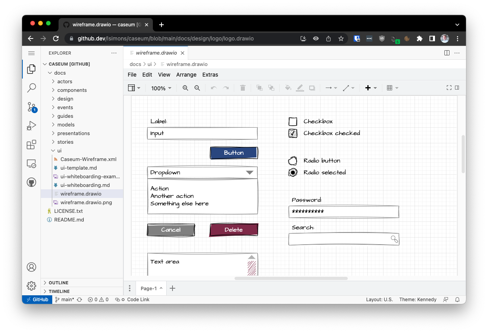

# Drawing architecture diagrams with draw.io

**[draw.io](https://www.drawio.com) (aka diagrams.net) is a free and [open source](https://github.com/jgraph/drawio) diagramming tool that can be used to draw architecture diagrams. It is available as a web application and as a desktop application for Windows, macOS and Linux.**

**While draw.io is not the most powerful diagramming software, is not an architecture-specific tool, and does not support formal modeling, it is _good enough_. Because it is open source, multi-platform, and has a web-based version, it is _accessible_. This accessibility is why it is the tool of choice for digital architecture diagrams in Caseum.**

## Templates

The following Caseum templates are available for draw.io:

| **View**            | **Draw.io Library**                                            |
|---------------------|----------------------------------------------------------------|
| **Components**      | [C4 Draw.io Library](../components/c4-template.md)           |
| **Actors**          | _use markdown_                                                 |
| **Stories**         | _use markdown_                                                 |
| **Events**          | [ES Draw.io Library](../events/event-template.md)            |
| **UI**              | [Wireframes Draw.io Library](../ui/ui-template.md)           |
| **Models**          | [TLM Draw.io Library](../models/tlm-template.md)             |

## Storing draw.io diagrams

Store your diagrams where you store your architecture documentation:
* If you use Confluence, use the [draw.io plugin for confluence](https://marketplace.atlassian.com/apps/1210933/draw-io-diagrams-whiteboards).
* If you use SharePoint, download the desktop version and save the files in SharePoint.
* If you use GitHub, store the files in your GitHub repository.

## VSCode and draw.io

The [draw.io integration for VSCode](https://marketplace.visualstudio.com/items?itemName=hediet.vscode-drawio) allows you to edit draw.io diagrams in VSCode. It is a great way to keep your diagrams in the same repository as your code, and to keep them in sync with your code.

## github.dev and draw.io

The draw.io integration for VSCode also works in [github.dev](https://github.dev). Replace `github.com` with `github.dev` in the URL of any draw.io diagram on GitHub repository to open it in github.dev. For example, you can try editing the [Caseum logo](https://github.dev/lsimons/caseum/blob/main/docs/design/logo/logo.drawio).
