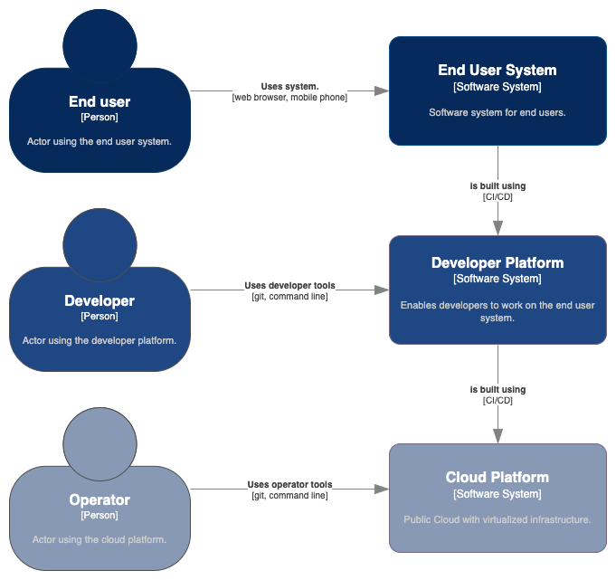

<!--suppress HtmlDeprecatedAttribute, CheckImageSize -->
# Designing platforms

For large systems it can be helpful to have a standardized platform on top of which the rest of the software is built. The platform may provide libraries, frameworks, shared services, or a hosting environment.

Do not describe this platform in detail as part of the Caseum documentation that also describes your end user system, You can document it as a distinct software system where the users are the developers.

You can have multiple layers of such platforms. For example, you may have one or more public cloud providers and a private cloud provider. On top of these clouds you may have a standardized container platform. You may have a standardized microservices framework deployed on that container platform. Finally, you may build many applications using that microservices framework.

This arrangement only makes sense for large systems of systems with many teams working on them. It is quite common for organizations to set up specialized platform teams too early. For smaller teams, choose simple and standard technology components that do not require much architecture work and focus on designing your application for your end users.
