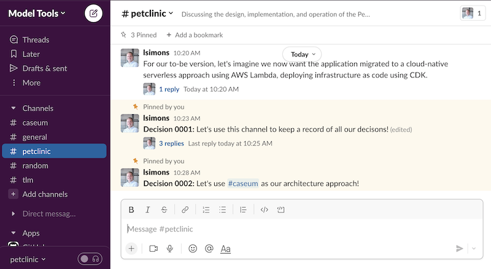

# Recording decisions

**Architecture records the important design decisions for a software system. The records are for communicating with current and future people working on and with the software.**

**Architecture is done by thinking together using views and tools that can be used by all the people working on the software.**

Record the important decisions and why they were made. Change the decisions when needed.

Architecture should be as simple as possible, as high level as possible, as informal as possible. It's better to have less architecture at a higher level that is kept up-to-date than have detailed information that's wrong. 

## Tooling advice for recording decisions

Use tools to help communicate simply and effectively. Using fewer, simpler, and more informal tools works well with Caseum.

When everyone working on the software is regularly in the same physical place, the walls of that place are a good place for the the architecture record. In all other cases, use a digital communication system, that everyone can use. The system should keep a permanent record and support images and other files. Use the system already in place if possible. Good systems include chat systems such as Slack or e-mail groups such as Office Teams/SharePoint groups.

When working on projects for multiple months, create a digital library. Good systems include wikis such as Confluence or online drives such as Office Teams/SharePoint drives. Use the system already in place if possible When making digital diagrams another tool can be integrated/linked with the library, such as the draw.io Confluence diagramming plugin.

When working with models as code or executable specifications, add a source control system like Git for those and link/integrate it with the digital library. 

## Consider Architecture Decision Records (ADRs)

Sometimes the approach for recording decisions is a little more formalized, using [Architecture Decision Records](https://cognitect.com/blog/2011/11/15/documenting-architecture-decisions).

You can combine ADRs with Caseum, but be careful:

* ADR approaches often make things more formal than needed. The people involved in the project may start to expect certain people to be involved in certain way, to act as owners or approvers or gatekeepers of the architecture.
* ADR approaches often supply detailed templates with a lot of details to capture about the decision, rather than just the decision itself. These details can be a distraction from the most important stuff, leading to people spending time filling out forms instead of thinking together and communicating.
* ADR approaches often advocate keeping all records in technical version control systems like Git. Some people involved in the project (like product managers, key stakeholders, project managers) may not be comfortable using git.

If you don't need the formality, keep things simpler. If you don't know if you need the formality, don't introduce it until you do.

A good sign that you need this kind of structure is if there is too much information that people are actually spending a lot of time looking for decision records, or looking for the right version of a decision record. That is more common on projects that last for more than 9 months, include more than 7 people, or have more than 50 diagrams.

## Consider Requests For Discussions (RFDs)

Sometimes the approach for making decisions is a little more formalized, using [Requests For Discussions (RFDs)](https://oxide.computer/blog/rfd-1-requests-for-discussion).

You can combine RFDs with Caseum, but be careful: the same formal focus that comes with ADRs can come with RFDSs. RFDs work best when your team or organization has established a strong culture of healthy discussion.

## Avoid RFCs, Enhancement Proposals, and Detailed Design Documents

Large, complex or safety crtical systems often use decision records that are more formal, using standardized processes to make the decisions. Do not use Caseum for such systems.

Such approaches include

* RFCs such as those used to design the internet: [IETF RFCs](https://www.ietf.org/standards/rfcs/)
* Enhancement Proposals such as those used to design programming languages [Python](https://peps.python.org/pep-0001/)
* Formal design descriptions such as thosed used to design military systems: [DOD System Design Descriptions (SDD)](https://www.standards.doe.gov/standards-documents/3000/3024-astd-2011) 
* Standardized formal design processes such as those used to design space systems: [ESA PSS-05-0](http://microelectronics.esa.int/vhdl/pss/PSS-05-0.pdf) and [ECSS-E-ST-40C](https://ecss.nl/standard/ecss-e-st-40c-software-general-requirements/)

## Avoid UML, ArchiMate, RUP, TOGAF, IEEE 1016

Architecture records can also be kept more formally using enterprise standards. Borrow good ideas from these standards but do not combine them with Caseum.

Such standards include

* The Universal Modeling Language (UML)
* The Open Group ArchiMate
* The Open Group Architecture Framework (TOGAF)
* The Rational Unified Process (RUP)
* The IEEE 1016 Software Design Description (SDD)
