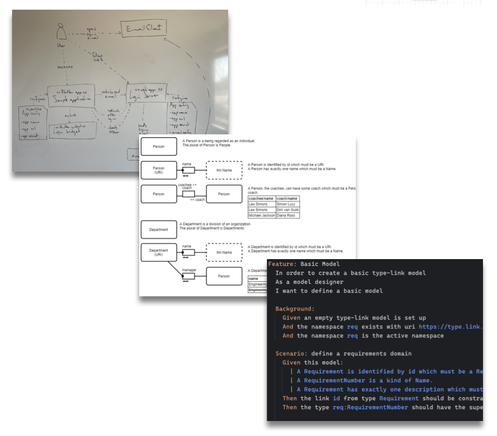

# Architecture stages

**Caseum has three stages of architecture to help do just enough architecture: don't go to the next stage unless you need it.**

**Prefer working software over comprehensive documentation, so do as little software architecture as results in good working software.**

Simple small systems should have simple small architectures. Single teams should have informal architectures. When small systems get bigger their architectures grow with them. When teams get bigger and split into multiple teams their design processes grow with them.

## Designing a new system

This description is about starting from scratch. Most architecture work is not for completely new ("greenfield") software systems but starting from scartch is the easiest way to learn Caseum. The steps you take for existing systems are described later as additions to this process.

### Stage 0: no need for Caseum

Small systems of 2000 lines of code or less or those built by 3 people or less do not need to use Caseum or any other specific approach to architecture. This stays true while all people on the team understand the whole system and the system quality remains high.

Only once the software system doesn't fit in everyone's head should you consider starting with Caseum.

Likewise, if you are or will be working something that is completely new where even the problem space is not clear yet, do not start with software architecture and so do not start with Caseum. Something like a [design sprint](https://www.thesprintbook.com/) may be a better start. Once you have built and validated one or a couple of prototypes you may be ready for architecture work.

### Stage 1: structured brainstorming & whiteboarding

When you have more than 3 people working on a system that is getting bigger, you can start brainstorming and whiteboarding together in a planned manner using Caseum step 1.

It does not really matter in which order you make the different Caseum views. Just make all the views that make sense, all at the same time, and keep going until you think you have all the important information or you are almost out of time.

You can use the general [guide on whiteboarding](whiteboarding.md).

#### Caseum whiteboarding step by step

"Everything all at once" is not always easy to do. If you need more structure, try this order:

1. **Actors**:
   * name the roles of the key actors using the software system.
   * write their needs for which they use the systems.
   * You can use the [guide on whiteboarding actors](../actors/actor-whiteboarding.md).
2. **Stories**:
   * Write the main goals the actors have that they use the software system for.
   * Break bigger goals down into coarse-grained scenarios called "epics", from "epic story"
   * Describe the epics in terms of activities by the actors for which they use the system.
   * You can use the [guide on whiteboarding stories](../stories/story-whiteboarding.md).
3. **UI**:
   * Sketch some basic wireframes of the UI the actors will use, if any.
   * If actors will use CLIs or APIs or get e-mails or reports, then sketch out some of those.
   * You can use the [guide on whiteboarding wireframes](../ui/ui-whiteboarding.md).
4. **Events**:
   * define the commands the actors will issue through these UIs to start on their activities.
   * Outline how the commands turn into different events that happen in the system.
   * Outline how the system will react to those events.
   * If you have a lot of events, try and group them into domains.
   * If you can, define coarse-grained events connecting the domains.
   * If a command, event, or reaction is not obvious to everyone then add some examples.
   * You can use the [guide on event storming](../events/event-storming.md).
5. **Components**:
   * Make a C4 context diagram showing the actors and their activities interacting with the system.
   * Make a C4 component diagram of the key components that make up the system so that all the different events reach a component.
   * Add the components needed to make those other components work. Give them a clear name. Add a description if it's not obvious to everyone.
   * Keep adding components until all the important components are sketched out.
   * If you have a lot of components, group them into stacks of closely related components and make a C4 container diagram.
   * If you have a lot of stacks, group them together into several distinct systems and make a C4 system landscape diagram.
   * If it is important to decide now what technology to use for some of components then write the technology used under the name.
   * You can use the [guide on whiteboarding C4](../components/c4-whiteboarding.md).
6. **Models**:
   * Draw circles for the main types that make up the the main events.
   * Add links between those main types as arrows and label the kind of link.
   * If a type or link is not obvious to everyone then add some example facts. 
   * Add additional important facts about each type that needs to be in the software system using additional facts and links.
   * Keep adding facts until enough of the types are sketched out that it is clear enough what all the events look like.
   * You can use the [guide on whiteboarding facts](../models/fact-whiteboarding.md).

Some advice while working through this order:
* Focus on capturing the most important design decisions. It is not important to be complete or have all the details.
* Try to go fast through each step. When you start slowing down during one of these steps, just move to the next one.
* During a later step you may discover other important information on previous steps, so go back and add it.
* If it seems like your group disagrees about a particular detail, slow down a bit. First figure out what the disagreement is. Write down a question. Then have a brief discussion. If consent on an answer is not quickly found, capture it as a topic to detail later. If you use [ADRs or RFDs](records.md), this may be a good topic for such a document.

#### Focusing in on specific concerns

Even though Caseum has 6 different views there can be yet other concerns that need more focus. For example, you may want to
* review the designs for security
* check the designs for consistency with some standard
* analyze the designs for non-functional requirements
* analyze the designs for technology/platform choices
* analyze the designs for lower-level/infrastructure needs
* analyze the designs for architecture characteristics like cohesion or modularity
* perform an [AWS well-architected review](https://aws.amazon.com/architecture/well-architected/) or another similar structured design review process

For most of these reviews you do not need to complete the Models view. You do need to Components view, and to have a good Components view you should have the other views to some level of detail as well.

To do so, draw the designs as you otherwise would. Then do an additional round to annotate the whiteboards based on those other issues. During the review write the issues on notes on the board, but do not immediately try to solve the issues. After you capture all the issues, prioritize them. Discuss only the important ones in more detail, and only as much as time allows.

#### Iterating during stage 1

After you have whiteboarded initial versions of all the views, stop designing and implement some parts of the system. During implementation you will learn a lot more which will inform your next iteration of the architecture. After you have implemented some software, make sure to test it, ideally by getting an initial production system in the hands of end users. When you do this you will learn a lot more.

After your first iteration, evaluate whether your implementation is very different from your architecture. If the designs mostly match your results, and you all sort-of know the next steps to take to implement the next iteration, you may not need to do more design yet.

During Caseum stage 1, do not worry too much about capturing the architecture permanently. There is a lot of value in just wiping (some of) the whiteboards and redrawing the design. Each time you redraw a picture you are likely to focus in more on what is important, leaving out the details that don't need to be in the picture. Each time you do this is an opportunity to discuss the design together further and create a better shared understanding of what to do. It is also an opportunity to practice drawing and designing. This may sound inefficient, but it is very effective. Try it!

#### Time budget for architecture

Experienced teams that have clear user goals & needs, and have built similar systems before, using similar technologies, may only need to spend only about 5% of their time creating and maintaining their design, i.e. about half a day at the beginning of a two-week sprint. Sometimes only a few of the people on the team need to do the design and the rest of the team can implement it.

If the team has less experience, the user needs are less clear, the system architecture is very new, or the implementation technology is new, it can be worthwhile to spend more time on architecture and design, up to perhaps about 20% of all the time available, or about 2 afternoons a week.

If you've spent more than a day a week doing architecture work, and this is not enough to know what to build during the rest of the week, spend some more time! This is one good indicator to start capturing designs more carefully - you may need to move to stage 2.

#### Digital whiteboards are "ok"

If you have a fully remote team using physical whiteboards may be impractical. In that case consider drawing on paper and sharing the designs using video conference software. You can also use online digital whiteboard software like [excalidraw](https://excalidraw.com/).

Be careful of switching to a fancy diagramming or modeling tool just because you are working remotely!

If you have the option, then physical whiteboarding is more effective. In a hybrid team that meets in an office one day a week, you could use a couple of hours of such a day for Caseum-style whiteboarding, then take some whiteboard photos home with you for the rest of the week.

### Stage 2: digital diagrams and decision records

During stage 2, you may still use whiteboards sometimes, but you also create and maintain a digital version of your designs.

Some of the Caseum views work best as text documents. Caseum recommends Markdown templates for text documents and provides templates.

Other Caseum views work best as visual diagrams. Caseum recommends draw.io for diagrams and provides templates and libraries.

#### Actively try to avoid stage 2

You want to stay in stage 1 if you can.

Do not start immediately with step 2, for most new projects maintaining a set of digital diagrams is too much structure too quickly. At best doing all that work will slow you down. What happens more often is that you stop maintaining or improving your design, and the designs grow stale, no longer matching the software system that is being built. It is better to have up to date designs in medium detail on a whitebaord, than to have out-of-date designs being ignored on a wiki.

But on the other hand if you do find yourself redrawing the same picture a lot, or explaining the same concepts over and over again, then it is time to move from phase 1 to phase 2.

There's other times where your team is _usually_ fine with whiteboarding, but you need some high quality digital artifacts for some other reason (like an important presentation or a compliance audit). If that's the case, by all means produce the digital diagrams. But after the event, throw the files away!

Ok, so perhaps you won't actually throw the diagrams away, fine. It's ok to print them out and stick them on your whiteboards. But what you should _not_ do is start investing the effort to keep the fancy digital pictures up-to-date if you have no real need for them.

#### Make digital versions of your stage 1 views

Your first step is to digitize everything. As you switch to a digital form, it is natural to be more precise and add more detail. Take the time to get the detail right. Usually that involves looking at the actual software system so you don't fill in the detail based on your memory but based on the current reality.

After you complete the first version of the digital views, review them. You may see things you want to change or improve in the system. Make a list, prioritize it, and perhaps plan to make the improvements.

#### Caseum digital designs step by step

1. **Actors**:
   * fill out a persona description for each of your actors.
   * You can use the [persona template](../actors/persona-template.md).
2. **Stories**:
   * break down all your epics and activities into clear user stories.
   * You can use the [story template](../stories/story-template.md).
3. **Events**:
   * group your events by domain, if you did not do so yet. Give the domains clear names.
   * create an event diagram for each domain.
   * You can use the [event template](../events/event-template.md).
4. **Components**:
   * Create digital versions of all your existing C4 diagrams.
   * Make sure all your actor personas are in the C4 context diagram.
   * Make sure all your event domains are in the C4 diagrams.
   * Create the C4 container diagram if you didn't have one yet.
   * You can use the [C4 template](../components/c4-template.md).
5. **Models**:
   * Do _not_ directly create digital versions of your model diagrams.
   * Instead create your model diagrams based on the model definitions in your software systems (like your domain model or your SQL database definition scripts).
   * Object-oriented or table-oriented modeling is more common than the fact-based modeling that Caseum recommends. You can [read why fact-based modeling is great](../models/fact-modeling.md) and decide to try it, or, you can use a modeling approach you already know.
   * If you decide to use fact-based modeling, you can use the [tlm template](../models/tlm-template.md).
6. **UI**:
   * Maintaining digital UI designs is relatively a lot of effort that may not be worth it for you just for your architecture.
   * If you are using a modern design tool like Figma already, you can use those designs instead.
   * If you do not have such digital designs, you can use the [UI template](../ui/ui-template.md) to make digital wireframes.
   * You can also choose to maintain your UI designs on paper or on whiteboards while you digitize the other views.

#### Keep more detailed records

See the [guide on keeping records](records.md).

During step 1 you may have not kept detailed records. If so, during step 2 it is worth to start doing so. This is also a good time to consider the use of ADRs or RFDs.

#### Iterating during step 2

The more architecture views you have to maintain, the more useful it becomes to work on them a little bit regularly. If you only do a "big bang" architecture update every few months, there are long periods when your architecture is not so useful since it is too out-of-date to use.

You could make updating the diagrams part of your [definition-of-ready](https://www.agilealliance.org/glossary/definition-of-ready) or your [definition-of-done](https://www.agilealliance.org/glossary/definition-of-done/).

Alternatively you could update the diagrams periodically, like at the beginning or end of a 2-week sprint.

#### Time budget for architecture

Creating the initial digital versions of all the architecture views can be a significant a one-off investment, perhaps up to a couple of weeks of effort if you managed to stay in stage 1 for as long as is recommended.

After that initial investment, maintaining the digital views will also take some time on an ongoing basis. It shouldn't take more than about 20% of your time, and 10% would be better.

If you find you do not have time for maintaining the diagrams, as a first step, clearly label the diagrams out-of-date. If the lack of up-to-date diagrams starts to cause you issues, then decide what to do. A good approach may be to only maintain the higher-level designs. Because those may change less frequently, this will be less effort.

If you have many stories, events, components or models, it may become more efficient to maintain them as code instead of as visual diagrams. That efficiency is the main reason to switch to Caseum stage 3.

### Stage 3: models as code and executable specifications

During stage 3 you define and maintain your Caseum architecture not using informal visuals and text documents, but with structured models as code and with executable specifications. You may generate some parts of your software from those models, or generate some of those models from your software.

#### Actively try to avoid stage 3

Many engineers like the idea of models-as-code in theory. It appeals to them because they like coding, so then coding the architecture also makes sense. There is also a promise of higher consistency. But such a technical approach can have serious downsides too:

* Requiring coding skills to work on the architecture excluding some team members
* Rigid inflexible technical tools making it hard to flexibly express the architecture of the system in the most clear way
* Spending effort on dealing with technical tools and frameworks instead of communicating design decisions and building working software

The larger and more complex a software system, the more likely there is value in adopting models as code. As a rule of thumb, it makes sense to start to evaluate using such tools when you have one system with over 50 components, over 100 models, and/or over 50 people working on it.

Note that if you created a great software design, you can end up with many independent small systems maintained by small teams that have limited interaction. In that case even for very large software landscapes, you still do not ever need stage 3!

#### Experiment!

Rather than just switch from stage 2 to stage 3, do some experiments. Create some initial prototype versions of structured models and specifications. Measure how much time it takes to do so. Then maintain those prototypes for some period (perhaps 3 2-week sprints) and see how much time that takes. Evaluate whether you save time compared to maintaining the visual diagrams. If so, great! Otherwise, are there enough other benefits?

#### Caseum models as code step by step

1. **Stories**:
   * Start writing your stories in Gherkin format.
   * You can consider using BDD and do automated testing using the Gherkin stories, which is a great benefit of Gherkin, which is why Stories are a good view to start Caseum stage 3 with.
   * You can use the [gherkin coding guide](../stories/gherkin-code.md).
2. **Components**:
   * C4 has a great textual format in Structurizr that is worth using if you have a lot of components.
   * You can use the [C4 coding guide](../components/c4-code.md).
3. **Models**:
   * If you use advanced fact-based modeling there are good bi-directional mappings between software systems and textual specifications and you should consider them.
   * For example, if you adopted TLM, you can use the [tlm coding guide](../models/tlm-template.md).
   * On the other hand, if you use UML or other object-oriented modeling techniques, do not use automated bi-directional mapping tools, they produce low-quality code. In this case it is better to work "code first", and write source code and generate the model definitions from your code.
4. **Events**:
   * You can consider using a formal standard for defining and maintaining event definitions.
   * If you have a lot of system-to-system events, you may already be using lower-level technical specifications, like Swagger for REST APIs or Avro for messaging systems. If so, there is little value in codifying the event view.
   * Otherwise, you can use the [cloudevents coding guide](../events/event-template.md).
5. **Actors**:
   * There's no executable specification for actors. Maintain the persona descriptions as text, like in phase 2.
6. **UI**:
   * There's no executable specification for UI.
   * If you have a large team working on a large software system that includes UI then you probably have dedicated UI designers. Let them maintain the UI views and link to it from your architecture documentation.
