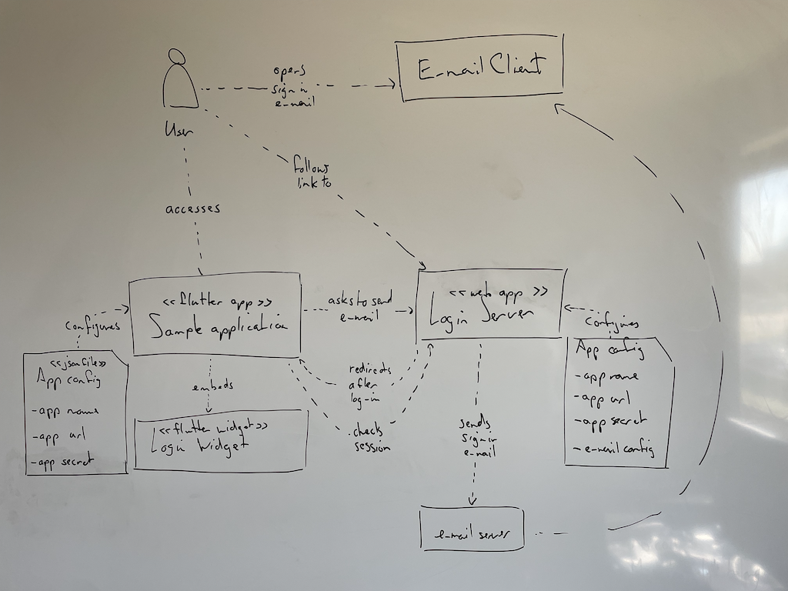

# Whiteboarding guide

**The goal of whiteboarding is a dialogue after which everyone has a common understanding of the software architecture, not to draw the best pictures.**

**It helps to be serious about whiteboarding. Prepare your whiteboarding sessions, practice your skills.**

## Preparing for whiteboarding

Like any activity whiteboarding sessions go better when you prepare for them well. So, prepare!

### Plan to capture your whiteboard outputs

Reserve time at the end of a whiteboarding session to immediately capture all of the content you produced in a permanent form and [record it](records.md). Taking photos with your cell phone and uploading them works well.

There are great free mobile apps that help process whiteboard pictures. Try Microsoft Lens ([Android](https://play.google.com/store/apps/details?id=com.microsoft.office.officelens), [iOS](https://apps.apple.com/us/app/office-lens/id975925059)) or Adobe Scan ([Android](https://play.google.com/store/apps/details?id=com.adobe.scan.android), [iOS](https://apps.apple.com/us/app/adobe-scan-pdf-ocr-scanner/id1199564834)). Try Post-It ([Android](https://apps.apple.com/us/app/post-it/id920127738), [iOS](https://play.google.com/store/apps/details?id=com.mmm.postit)) if you have a whiteboard full of post-it notes. Have such apps on your phone before the session.

There are also great mobile apps for keeping digital records. If you use Slack, have the slack app on your phone. If you use SharePoint, have the onedrive app on your phone. Log into the apps beforehand and try uploading some pictures with them.

### Have lots of materials

* It is great to have lots of whiteboards (7 is a good number). Even better is a room where all the walls are whiteboards. On a budget you can get whiteboard stickers to put on walls or windows.
* Have enough markers in multiple colors (black, blue, green, red).
* Have dry-wipe cloth plus whiteboard cleaning spray to clean the whiteboards. Cheap cloths often work better than whiteboard eraser blocks.
* Have enough decent quality sticky notes. The adhesive on old or cheap sticky notes gets worse and then the notes may come down off the board. Have multiple colors (for event storming, orange, purple, blue, green).

## Practicing whiteboarding

Drawing is a skill you get better at through practice. So, practice!

### Get comfortable with writing on whiteboards

Practice your writing on a whiteboard:
* Try to write more slowly, drawing nice letters instead of scribbling ugly ones.
* Try to write in a straight line.
* Try to write vertically.
* Try to write larger and smaller letters.
* Try to estimate how many letters you can fit in an area. Draw smaller and bigger boxes and try to write certain words in them.

Evaluate your own writing by looking at the board at a distance. Then wipe it out and do better. If there are certain letters you can't write well, practice just those letters.

Your handwriting does not need to be pretty but it should be readable.

### Get comfortable with drawing on whiteboards

Practice simple drawing on a whiteboard:
* draw lots of rectangles of different sizes.
* draw lots of squares of different sizes.
* draw lots of straight lines of every angle.
* draw lots of ovals and circles.
* draw simple symbols for people.

You can find a lot of specific drawing exercies online, but you don't need to learn creative drawing. Just do a lot of drawing and actively try to do a good job at it and you will improve.

### Draw to take photos

Practices whiteboarding to capture the result:
* make a simple diagram on a whiteboard with boxes, lines and text
* take a photo of the diagram with your phone
* look at the photo
* see what does and does not look good in the photo, pick one thing to improve
* wipe the drawing and try to make the same drawing again
* take another photo and see if the result is better
* rinse, repeat

When you plan to take a photo of a whiteboard later you will often make a nicer drawing.

### Draw with colors

Practice whiteboarding with colors:
* study the Caseum color scheme and try to make drawings on the whiteboard in the same or a similar color scheme
* practice keeping multiple markers in your hands and switching between them as you draw

Once you are used to drawing with multiple colors it will help make the output of your brainstorming sessions look better.

## Talking through designs together

The whiteboard is a tool you use to make a design. The design is a tool you use to communicate how to make software. Effective communication is more important than the picture that ends up on the whiteboard.

### Start with an empty board and go slowly

Just like a powerpoint slide with 20 bullets is overwhelming, a huge whiteboard filled with 20 different boxes and lines between them is overwhelming too. When sharing a design on a whiteboard, start with an empty whiteboard, and take the time to explain each element as you draw it on the board. Make sure your listeners are still following before drawing another box or another line. Go slow, pause, be open for questions and suggestions.

### Drawing together: blue pen, green pen, red pen, no pen

When designing together, someone should start and draw _something_. Drawing the first concept on a blank canvas can be a bit intimidating for some. It is nice to have someone that goes first. Even if the first idea is not fully fledged, at least we got started. This might be someone using a blue pen.

Others may not start the concept, but once something is on the board they are very good at saying "yes, and..." to add to the initial idea to expand it and make it better. This might be someone using a green pen.

Still others are very comfortable saying "no, because..." to reduce an idea to the important essence or to challenge the group to come up with a better alternative to the initial idea. This might be someone using a red pen.

Finally there are those that may not do any of the drawing themselves but they can ask the group good open "what about ..." questions to move the design forward. This person does't need a pen!

To draw a good design together as a group, all of these contributions are needed. It is useful to get good at each style of contribution, and to know when which contribution is needed. It can be a good exercise for people in a team to deliberately take one of these roles, even if they would normally take a different one. You can also rotate between these roles in a way similar to [pair programming](https://www.agilealliance.org/glossary/pairing/) or [mob programming](https://www.agilealliance.org/glossary/mob-programming/).
