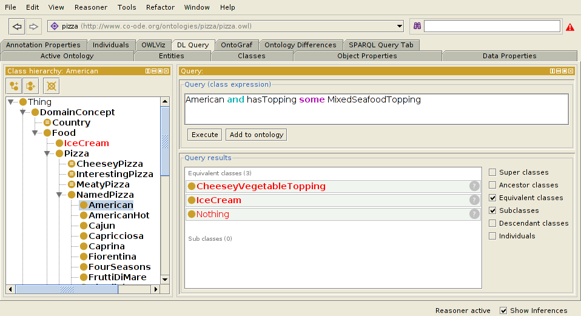

# Describing Models using Type-Link Modeling and TLMD

**Fully and formally describe your model in code using TLMD.**

```
--- Person
A Person is a "being regarded as an individual".

A Person is identified by id which must be a URI.
A Person has exactly one name which must be a Name.
A Person has toggle coaches.
A Person, the coachee, can have some coach which must be a Person, the coach.
  Examples:
    coachee/name    | coach/name
    ================================
    Michael Jackson | Diana Ross
    Peter Parker    | Tony Stark
    Peter Parker    | Aunt May
```

[Type-Link-Model](https://type.link.model.tools/) includes a plain text modeling format, TLMD. TLMD is a great way to capture a model in a way that is both human-readable and machine-readable. Decent-looking visual diagrams can be generated automatically from TLMD.

You can also generate XML Schema, JSON Schema, and other such artifacts from TLMD.

## Consider using ORM instead of TLMD

ORM has a similar plain text modeling format, which is more powerful than TLMD. If you need all the power of ORM, use it instead.

## Why not UML or ER?

See [Fact-Based Modeling](fact-modeling.md) for a description of the advantages of fact-based modeling techniques over more well-known approaches such as UML class diagrams.

## Why not OWL (Web Ontology Language)?

[OWL](https://www.w3.org/TR/owl2-overview/) is a powerful modeling technique for the [semantic web](https://en.wikipedia.org/wiki/Semantic_Web). Because the semantic web uses the [open-world assumption](https://en.wikipedia.org/wiki/Open-world_assumption), it is hard to create high-performance software that natively uses its models. Only use OWL if your problem requires a web-scale solution.


