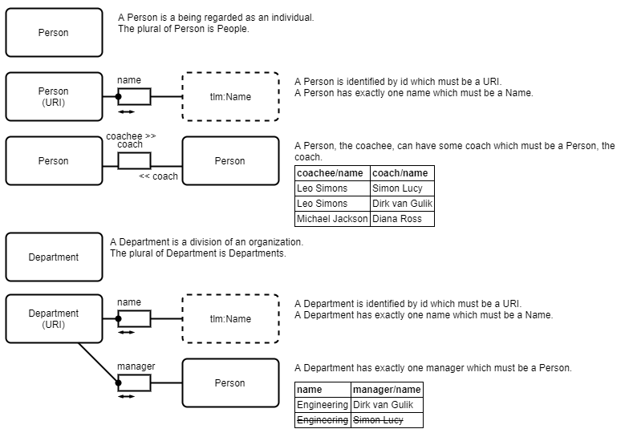

# Describing Models using Type-Link Modeling and draw.io

**Draw the facts of the domain model using a formal syntax.**

[Type-Link-Model (TLM)](https://type.link.model.tools/) is a fact-based modeling technique inspired by but simpler than [Object-Role Modeling (ORM)](http://orm.net/). Using a formal syntax and semantics based on types and the links between them, TLM allows capturing most domain models precisely.

TLM provides draw.io stencils and examples that you can use with Caseum [stage 2](../guides/stages.md).

## Consider ORM instead of TLM

[ORM](http://orm.net/) is the work of scientist [Terry Halpin](https://en.wikipedia.org/wiki/Terry_Halpin) who has written a seminal book on logical database design, [Information Modeling and Relational Databases](https://www.amazon.com/Information-Modeling-Relational-Databases-Conceptual-ebook/dp/B006OLTQ2W/).

ORM2 is a complete superset of modern UML class diagrams and allows clear expression of any relational model plus the associated business rules that you could capture using UML its Object Constraint Language (OCL). If you need such modeling rigor ORM is the only choice.

But the vast majority of projects have simpler needs and so can make do with a small compatible subset of ORM that is easier to learn, which is what TLM provides.

## Consider other Fact-Based Modeling techniques

Alternative fact-based modeling techniques include [NIAM](https://en.wikipedia.org/wiki/NIAM), and [FCO-IM](https://en.wikipedia.org/wiki/FCO-IM). Most such techniques were created to provide additional power and rigor beyond ORM so are most suited to advanced needs.

## Why not UML class diagrams or ER?

See [Fact-Based Modeling](fact-modeling.md) for a description of the advantages of fact-based modeling techniques over more well-known approaches such as UML class diagrams.
