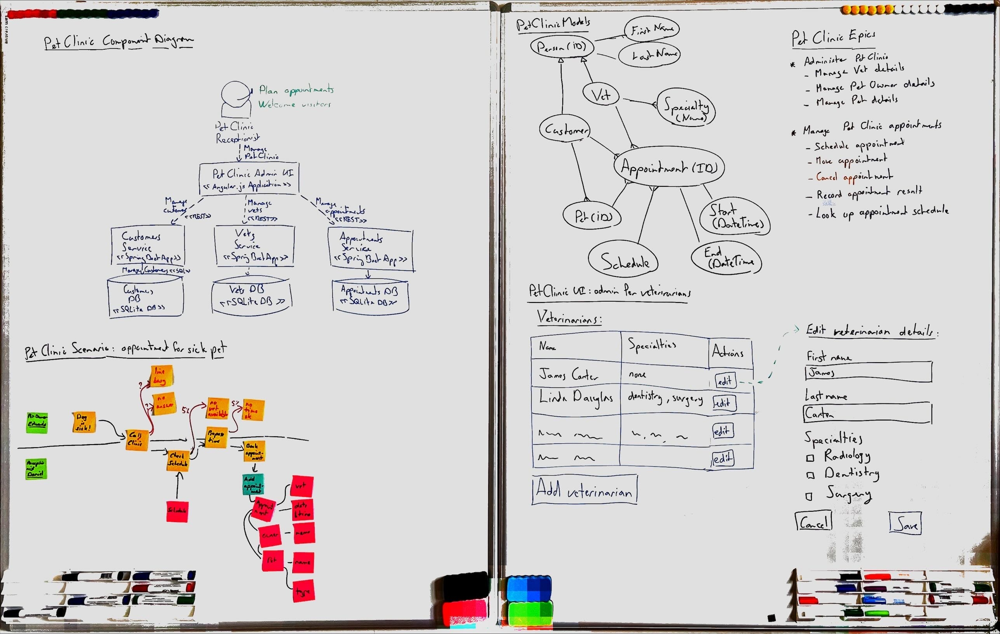
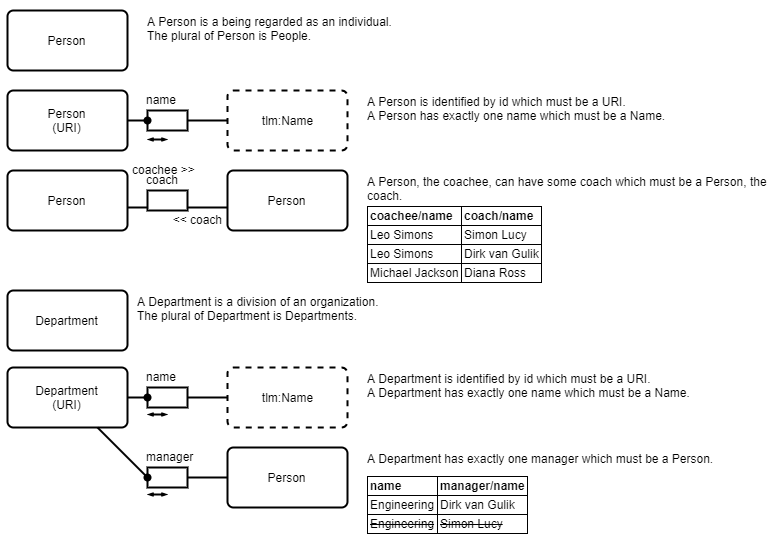
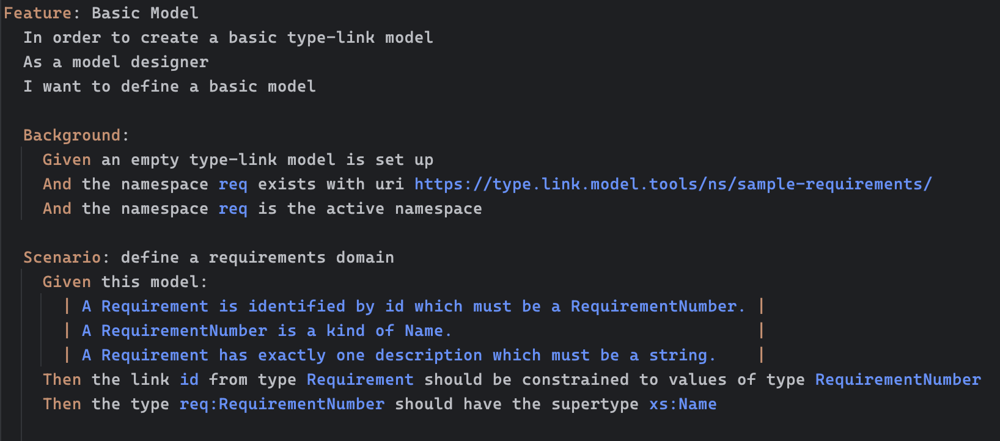
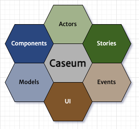
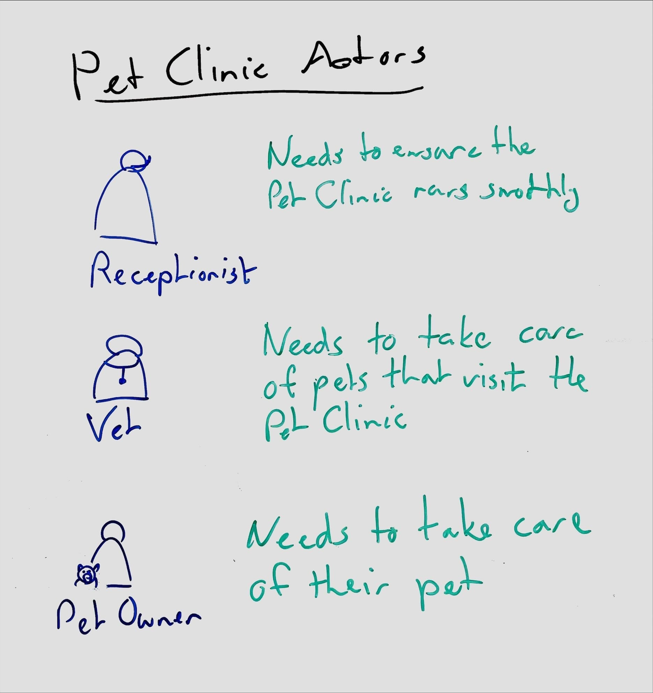
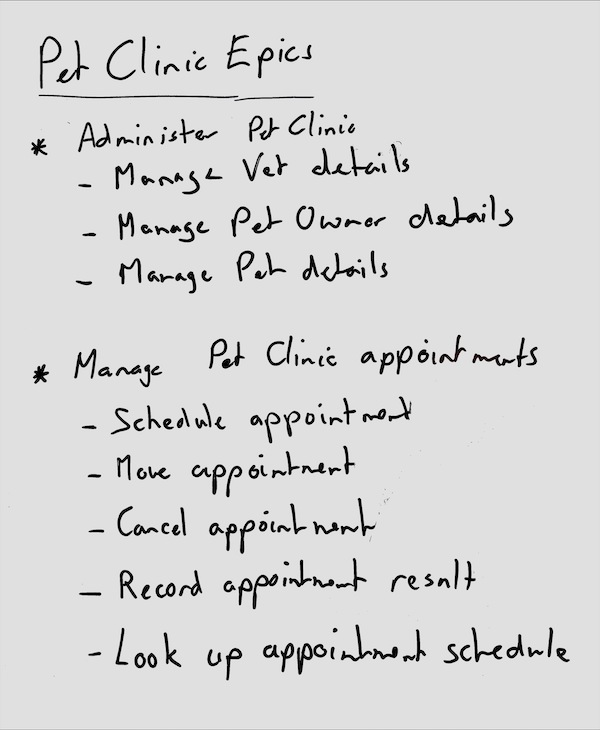
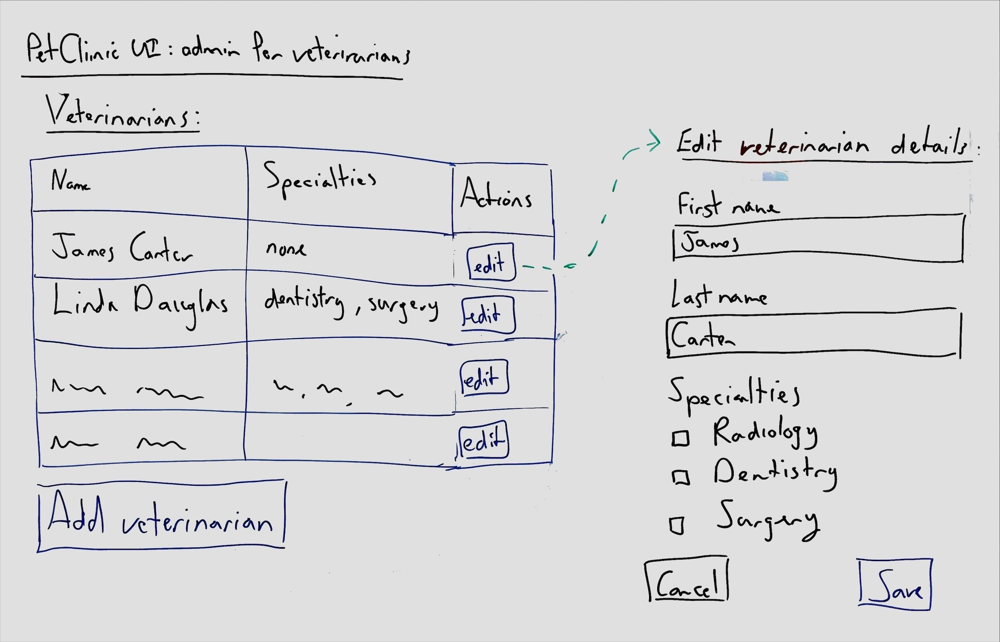
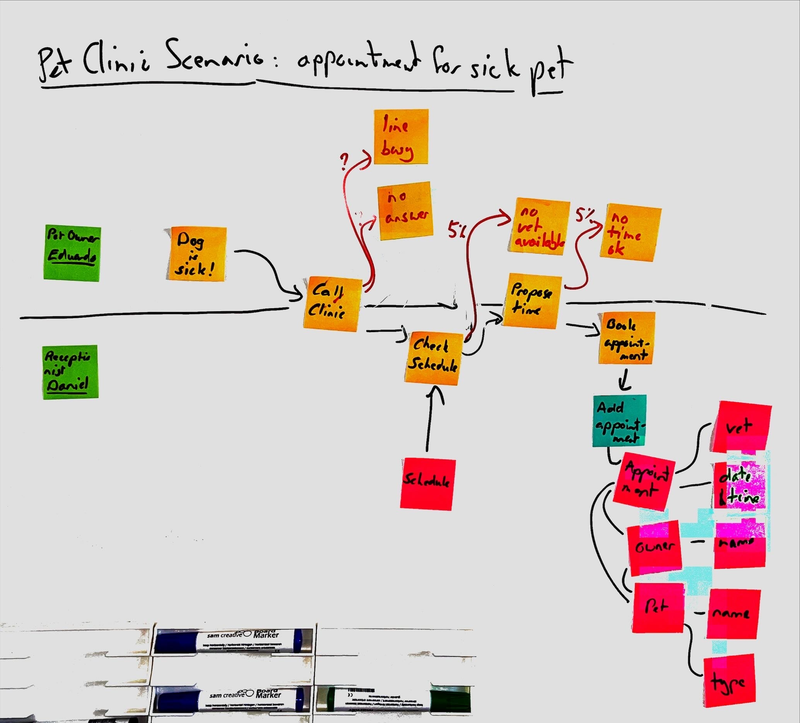
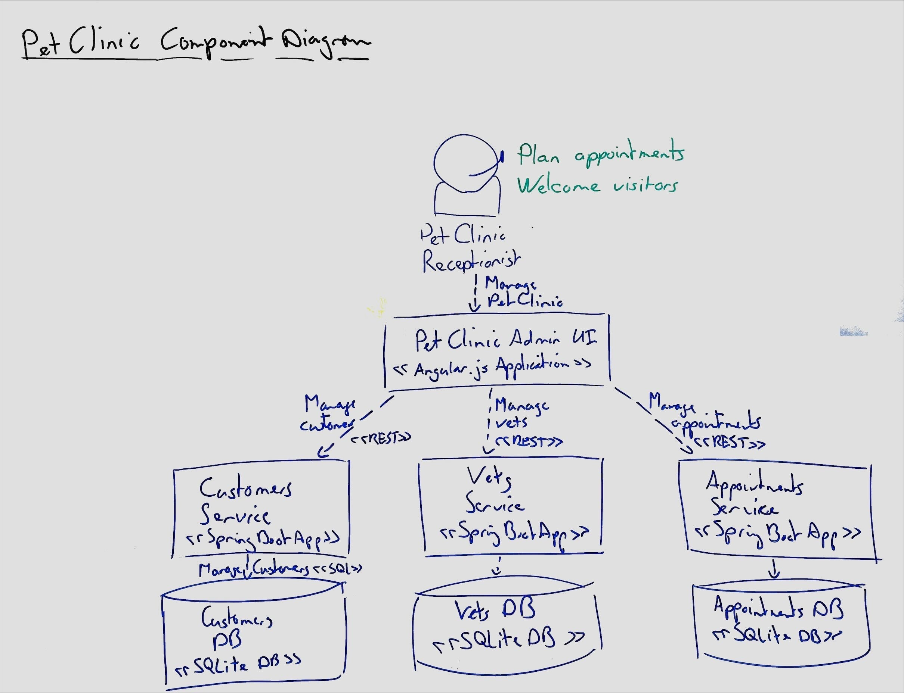

# Introduction

## Key concepts

:::: {.columns}
::: {.column}
* **Multiple views:**
  * Use C4 for component diagrams
  * Include other views for other important information
* **Lightweight approach:**
  * Don’t use a digital diagram when a whiteboard picture will do
  * If you do need structured models, use lightweight text-based syntax
  * Focus on interactions over processes and tools
:::

::: {.column}
* **User-centric:**
  * Include UI designs since they help users understand
  * Include Actor personas and scenarios since they drive the design
  * Events are a good way for users to understand systems
* **Standardise common best practices:**
  * Embeds established practices like Event Storming and Domain-Driven Design
  * Agile development context expected
:::
::::

::: {.notes}
Caseum is simple and lightweight. It focuses on using whiteboards, interacting with users and stakeholders, and adopting best practices. Caseum adopts C4. It goes beyond C4 by including other kinds of views, and it goes against C4 in recommending you do not start with models as code.
:::

## Architecture = communication

:::: {.columns}
::: {.column}
**Use simple, accessible tools:**

* Architecture records design decisions
* Designs are recorded for people working on and with the software
* Prefer tools that untrained non-technical people can use
* Slack & Email over Documents
* Wiki/SharePoint over Version Control
* Readable text files over Formal Methods
:::

::: {.column}

:::
::::

::: {.notes}
That’s because software architecture is about making decisions together. The architecture is a record of those decisions. This record should be useful to those making the software and to the people they work with. So, use simple and accessible communication tools.
:::

# 3 Stages

## Lightweight approach

:::: {.columns}
::: {.column}
**Three stages as projects get bigger:**

1. Brainstorming & whiteboarding
2. Digital diagrams & decision records
3. Models as code & executable specifications

…use only what you really need.
:::

::: {.column}

:::
::::

::: {.notes}
Caseum has three stages. In the first stage you just use whiteboards. This is enough for many projects. For bigger projects you start to use digital diagrams and digital decision records. That’s stage two. There is also stage 3, formal models. You want to avoid stage 3 because it is often overkill. But for large complex projects, the effort to maintain formal models of your architecture can be worth it.
:::

## Stage 1: whiteboarding

:::: {.columns}
::: {.column}
**Design is an activity: draw again and again**

* Draw the software design on a whiteboard using multiple different views
* Take pictures of the whiteboard and add them to decision records
* Drawing a picture while talking about it is a powerful way to share designs
* Caseum shows how to draw different views on the whiteboard
:::

::: {.column}

:::
::::

::: {.notes}
During caseum stage 1 you draw your design in several ways. You talk about it together while drawing. Then you draw it again. The design gets better and better. And then as soon as it is good enough, take some pictures and stop drawing, because, you’re done.
:::

## Stage 2: digital diagrams

:::: {.columns}
::: {.column}
**Use draw.io for high quality visuals**

* When whiteboarding stops working…
* Create high-fidelity digital versions of the different Caseum views
* Use the draw.io libraries and templates Caseum provides
* Start keeping a digital record of your design decisions
* Use the simplest and most accessible digital tools so everyone can contribute to the design
:::

::: {.column}

:::
::::

::: {.notes}
For larger projects you can end up in a situation where you keep redrawing the exact same picture the exact same way. It starts to make sense to go digital. When you do so, the next step is to create higher quality versions of each of the Caseum views. I recommend using draw.io which is open source and web-based.
:::

## Stage 3: models as code

:::: {.columns}
::: {.column}
**Create structured text versions of views**

* Overkill for most projects
* Especially if you have modular architecture & independent teams
* When investing in codifying your architecture, focus on gaining back other benefits, such as
* Automated testing
* Generating code and docs
* API contracts
:::

::: {.column}

:::
::::

::: {.notes}
For really large projects maintaining the digital diagrams becomes a real hassle. Large teams produce a lot of software, and then the architecture description of the software can go more and more out of date with the real system, to the point that the architecture is no longer useful. When this happens and only when this happens is stage 3 worth it. In stage 3 you use code to create formal models.
:::

# 6 Views

## The 6 views in Caseum

:::: {.columns}
::: {.column}
**Caseum is a mnemonic:**

* **C**omponents using C4
* **A**ctors using roles
* **S**tories using Gherkin
* **E**vents using event storming
* **U**I using wireframes
* **M**odels using facts
:::

::: {.column}

:::
::::

::: {.notes}
Caseum suggests most software projects use 6 different views. Components, Actors, Stories, Events, User Interfaces, and data Models.
:::

## Actors

:::: {.columns}
::: {.column}
**Caseum adopts role descriptions for the key actors**

* Having a clear picture of your users in mind helps to make software accessible
* Deciding on your key users may be hard but helps to build the right thing
* Always capture at least the role (or system) **name** and their key **need** from the software you are designing
:::

::: {.column}

:::
::::

::: {.notes}
The first view is of actors. Who are the users of the system? Decide and agree at least the role name and what they need the system to do. Spending time describing the actors clearly helps a lot to make the other views better.
:::

## Stories

:::: {.columns}
::: {.column}
**Caseum adopts user stories for functionality**

* Describing functionality with and in the language of your users helps to make software that is useful
* Write just enough detail so everyone involved understands what is needed and add other Caseum views for more detail
* Implementing software one user story at a time is sometimes an option but Caseum does not recommend it
:::

::: {.column}

:::
::::

::: {.notes}
User stories are the second view. How do the actors use the system? User stories are often used in planning agile projects, which, if you want to do that, fine. But regardless of how you plan your work, be clear about how the system gets used. It makes the rest of the design better.
:::

## UI

:::: {.columns}
::: {.column}
**Caseum adopts wireframes for the user interface**

* Talking through how the UI will look and function with users and stakeholders helps clarify the other views
* Because wireframes limit detail they are easier to discuss and change
* Involve skilled UI/UX designers when possible
:::

::: {.column}

:::
::::

::: {.notes}
User interfaces are the third view. Capture them using wireframes so you don’t focus too much on details. UI design is a skill distinct from software design, and it can really help to have a specialised UI designer on a project. But if you don’t have a UI designer it is better to do a bad job yourself, than not do it at all. Of course systems without UI do not need this view.
:::

## Events

:::: {.columns}
::: {.column}
**Caseum adopts Event Storming for business domain events**

* Talking through the processes that software supports is a great way for developers to gain understanding of the business domain
* Having the whole process in one picture helps to make good choices for how to break large systems into pieces (by “bounded context”)
:::

::: {.column}

:::
::::

::: {.notes}
Fourth is the event view. Especially for more complex business software, having a good overview of the key events that occur in the business workflow really helps to design better systems. Caseum adopts event storming for creating the event view. Event storming is great!
:::

## Components

:::: {.columns}
::: {.column}
**Caseum adopts C4 for components**

* Focus on telling the story of your architecture over following the C4 model exactly
* The context and component diagrams are the most important, container diagrams can come later
* Avoid structurizr / models-as-code as long as you can
:::

::: {.column}

:::
::::

::: {.notes}
Only after the 4 earlier views of actors, stories, UI, and events have gotten some attention is it time to design the breakdown of the software into components. C4 is a great way to create the component view, and it also works really well on a whiteboard.
:::

## Models

:::: {.columns}
::: {.column}
**Caseum adopts fact-based modelling for types**

* Capture just the key facts in designing your data models
* Decide the physical structure of your data as late as possible, focus on the logic first
* Add examples of facts to make the model clear
:::

::: {.column}

:::
::::

::: {.notes}
Finally it often helps to create an explicit data or domain model. Caseum suggests using fact-based modelling, which is like the LISP of information architecture, in that it is strictly superior to more popular approaches like ER diagrams or UML. Try to avoid UML!
:::

## Caseum

**The simplest software architecture approach that could possibly work**

::: {.notes}
That’s the intro! This is how I tend to do software architecture. If you want to know more, check out the Caseum project at github dot com slash lsimons slash caseum.
:::
