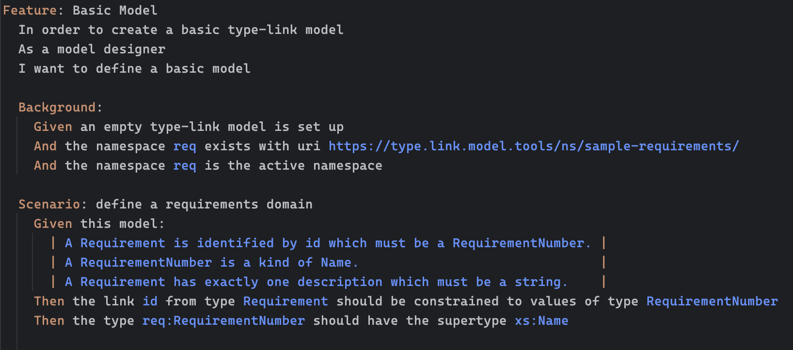
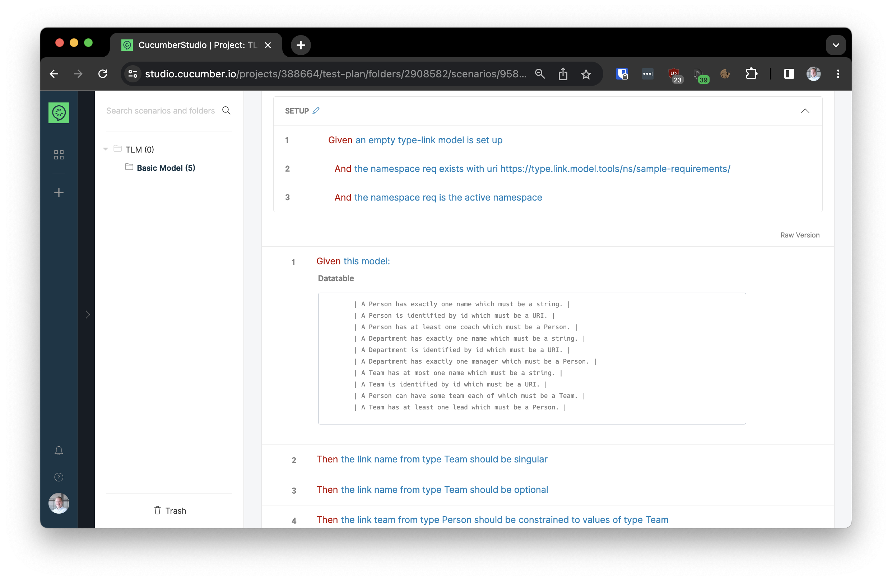

# Behavior-Driven Development using Gherkin stories

**Use [Gherkin](https://cucumber.io/docs/gherkin/) to turn your user stories into executable specifications.**

Gherkin is a simple language for describing the behavior of software. It is used by [Cucumber](https://cucumber.io/), [SpecFlow](https://specflow.org/), and other tools, Gherkin is used to turn user stories into executable specifications.

When using Gherkin to capture stories as code, consider using VSCode with the [Gherkin extension](https://marketplace.visualstudio.com/items?itemName=alexkrechik.cucumberautocomplete) extension. If you use JetBrains IDEs, you can use the [Gherkin plugin](https://plugins.jetbrains.com/plugin/9164-gherkin) instead.

Keep the Gherkin stories in the same repository as the code they describe. This makes it easier to keep the stories up to date as the code changes and to run them as continuous integration tests.

You can also use [Cucumber Studio](https://cucumber.io/studio/) for writing stories. Cucumber studio helps non-technical authors to create Gherkin stories but it is relatively expensive for its limited feature set.

